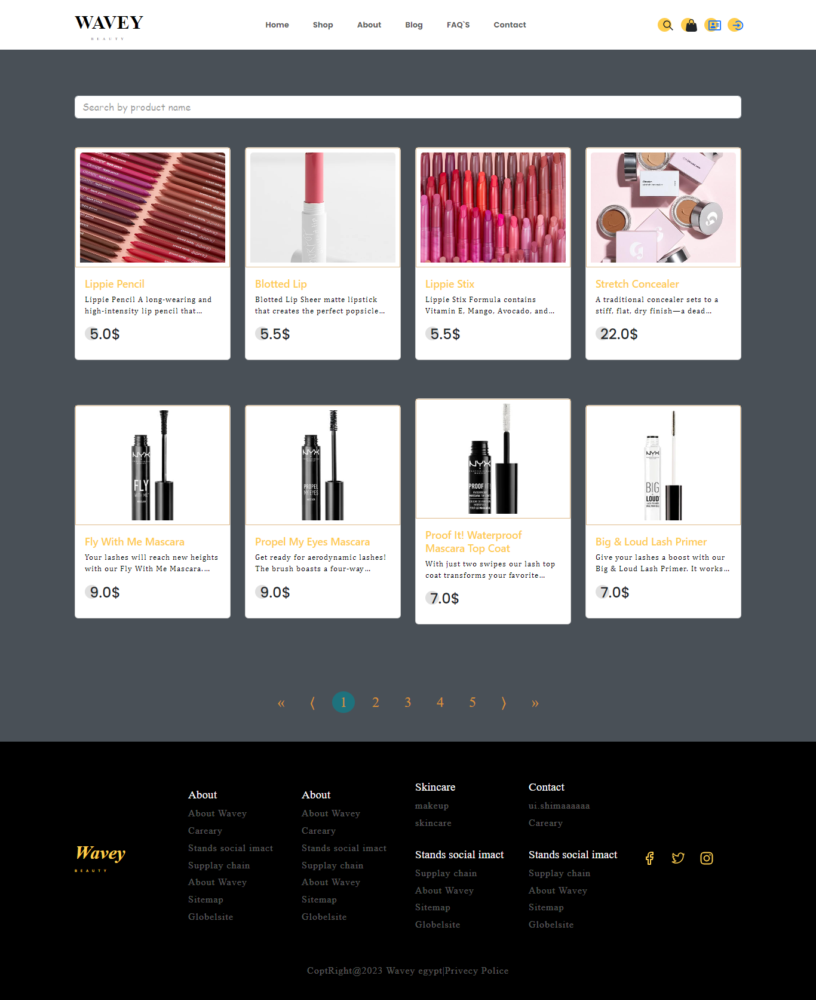

 ## E-commerce Makeup Project

This is an e-commerce project for makeup products designed with React, Bootstrap, Redux, CSS, and Context. The project allows customers to browse products, add products to their cart, and place orders. It also includes an admin panel for managing products, orders, and customers.

## About Website

The e-commerce makeup project includes the following pages:

- Responsive UI
- Home Page (/home).
- About Page (/about).
- Blog Page (/blog).
- FAQs Page (/faqs).
- Contact Page (/contact).
- Product Details Page (/product).
- Cart Page (/cart).
- Search Page (/search).
- Login Page (/login).
- Register Page (/register).
- Page Not Found (*).

## Features

The e-commerce makeup project includes the following features:

- Browse makeup products.
- Add makeup products to cart.
- Place orders.
- Admin panel for managing makeup products, orders, and customers.
- Search for makeup products.
- User authentication and authorization.

## Technologies Used

- React
- Bootstrap5
- Redux
- CSS
- Context

## Screenshots

Here are some screenshots of the different pages in the project:

### Home Page

### About Page

### Blog Page 

### FAQs Page 

### Contact Page

### Product Details Page

### Cart Page

### Search Page

### Login Page

### Register Page

### Page Not Found

